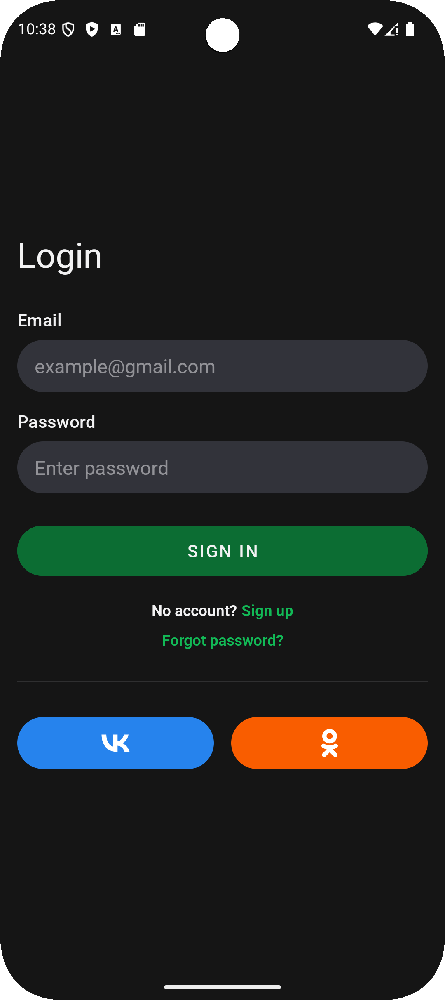

# Mentora

Mentora is an Android demo application built with **Kotlin** and **Clean Architecture** principles.
It showcases modern Android development practices such as dependency injection, reactive UI updates, and offline storage.

## Features

* **Login screen**

  * Enter any email and password (≥ 4 characters) to "log in"
  * Social login buttons redirect to **VK** and **OK** (mocked)

* **Home screen**

  * Displays a list of courses
  * Sort courses by publish date
  * Search bar & funnel filter button (UI only, not functional)
  * Bottom navigation with:

    * **Home**
    * **Favourites**
    * **Profile** (UI only, not functional)
* Localization
  * Available in English and Russian 🇬🇧🇷🇺

## Tech Stack

* **Language**: Kotlin
* **UI**: XML layouts
* **Architecture**: Clean Architecture (Presentation, Domain, Data layers)
* **Persistence**: Room
* **Networking**: Retrofit
* **Dependency Injection**: Koin
* **Reactive UI**: LiveData

## Getting Started

1. Clone the repository:

   ```bash
   git clone https://github.com/The-uncanny-valleu/Mentora.git
   cd mentora
   ```
2. Open the project in **Android Studio** (latest version recommended).
3. Build & run the app on an emulator or physical device (API level 29+).

## Screenshots

<table>
  <tr>
    <td></td>
    <td></td>
   <td></td>
  </tr>
</table>

## Project Structure

```
mentora/
 ├── data/           # Repository implementations, Room, Retrofit
 ├── di/             # Koin modules
 ├── domain/         # Entities, UseCases
 └── presentation/   # ViewModels, Activities, Fragments
```
## Notes

* This is a **demo project**. Login and some features (search, profile, filters) are **not functional**.
* The goal is to demonstrate **Clean Architecture** and modern Android stack integration.
